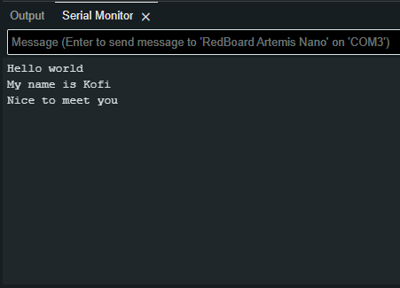
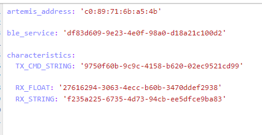
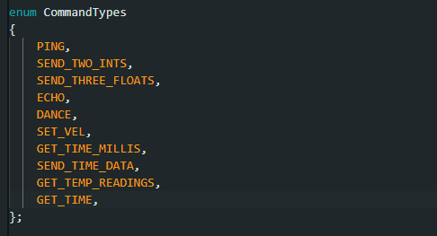
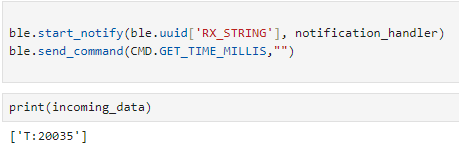
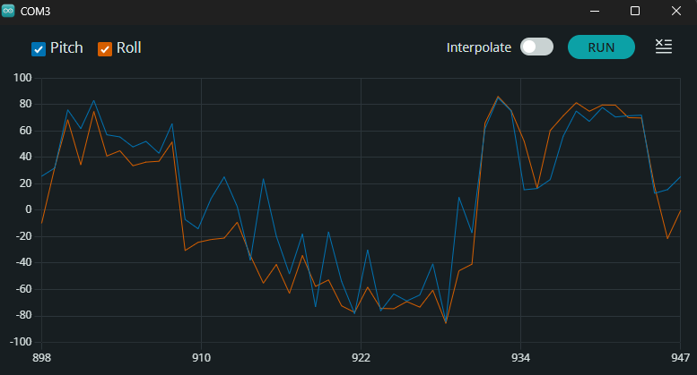
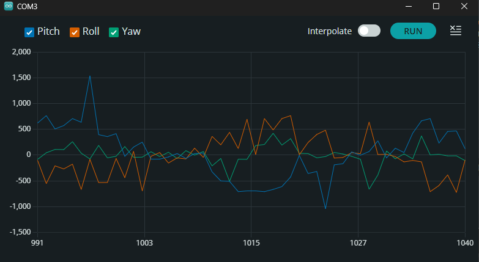

ECE 4160

My name is Kofi Ohene Adu (kao65). This page contains the labs I have completed for this course. I am an electrical and computer engineering student, with an interest in robotics and languages. I like video games, playing the guitar, and pretty much like listening to music in general.
Welcome to my Fast Robots page! This is a work in progress!

# Lab 1: Introduction to Artemis 
## Part 1
The objective of this part of the lab is to test Artemis board functionality, by testing the LED, Temperature sensor, Serial output, and microphone.

### "Example 1: Blink it Up"
The “Blink it Up” example was used for this portion of the lab. The code, when compiled would turn the LED on for a specified amount of time, then would turn it off. Below is the result:

*Note: Will take you to the video itself*

### "Example 4: Serial"
This example found under Artemis examples, was used to test the serial monitor output. It would print out any messages that were typed in the input space, as seen in the image below.

*Serial test Image*

### "Example 2: Analog Read"
This example  was used to test the temperature sensor on the Artemis board.  The test would send the temperature reading and time to the serial monitor and would slightly change the temperature number as I applied warm air. ( Change is tiny, about 0.2 from 33.7 to 33.9, likely due to the surrounding room temperature being warmer than usual). Below is the result

*Note: Will take you to the video itself*

### "PDM/Example 1: Microphone Output"
The microphone output example was used to show the frequencies picked up by the Artemis board. There would be a slight change as I released a higher-pitched whistle in time and would decrease as I stopped. Below is an image and video of this:

*Mic test Image*

*Note: Will take you to the video itself*

## Part 2: Bluetooth Setup
The objective of this part of the lab was to establish a Bluetooth connection between the Artemis board and the computer and to indicate its functionality. In this section, we worked in tandem with both Arduino and Python (using Jupiter lab) to connect the Artemis through Bluetooth, then send data to the board over Bluetooth as well

### Prelab
We were tasked with installing the virtual environment that was to be used during the rest of the labs and installing the necessary packages for it. Next was to unzip the codebase to be used during this lab and the later ones also.
Next was to find and change the necessary MAC address and UUIDs for our individual Artemis boards. The change is to be made in the ble_arduino.ino  file in the ble codebase. Since many boards could share the same MAC address, also using their UUIDs is a recommended step. This change would be replicated in the connection.yaml file shown.

*Mac Address*

*UUID*

*Connections in both Arduino and Python files*

### The Connect

*How ble connection is done*

### "ECHO" Command
An ECHO command was to be implemented to test the connection between the computer and the Artemis board. This command would send a character string to the board from the Python code, then when printed, it would send the phrase back to the Python code.

*Echo Implementation*

*Echo results*

*Note:* Whenever a new command was to be created it was to be added to the CommandTypes list. Each command would have an assigned value addressed to it and then we would need to add that command and its value to the cmdtypes file on Jupyter Notebook, as shown below.

###  "GET_TIME_MILLIS" Command
This implementation involved receiving the current time from the Artemis board. This involved using the millis() function to get the current time in milliseconds and then convert it to an int. The result was presented as a string. The implementation is shown below.

### GET_TIME Command

### Notification Handler
The notification handler is used to automatically receive the data sent by the Artemis board without manually calling the data each time.  For the code, I decided to use an array at each initialization of the code so that all the data would be put in an array, whether it was a single value or an assortment of them. This piece of Python code will be very helpful as we create multiple functions to collect data (including those containing arrays)

Whenever the notification handler is being used, it is “told” to collect the data received by calling the start_notify() function as shown below. 

This is done only once for the handler to function. To stop the handler from collecting information, we just issue the stop_notify() command on the Python file 

### "SEND_TIME_DATA" Command
This command was used to get each time reading for 50 seconds. Similar to the GET_TIME_MILLIS command it would get the current time at each iteration of the loop and then put it in a time array to be received by the notification handler. 

### "GET_TEMP_READINGS" Command
This command involved extracting many temperature readings in the span of a few seconds. For this code, I created another array to hold the temperature reading and then appended each value in the array to its corresponding time value. The data was then sent as strings by a for loop to the Python code. This reduced the need to have another command  to send the data just like in the SEDN_TIME_DATA command

### A Limitation
The Artemis Board has a maximum storage of 384 kB of RAM. If we sampled 16-bit values at an average frequency every 50 seconds, we would be able to create about less than 30 values before the storage on the Artemis board would run out. Sending data in groups would thus optimize the speed of data acquisition from the Artemis board.

# Lab 2: IMU ( Still in Progress)
The goal of this lab was to set up the integration between the Artemis board and the imu to gather the robot's relative angular orientation data (pitch, roll, and yaw). Another step was to enable the Artemis board the ability to send this data over Bluetooth for processing.

### Setup the IMU
First, we hook up the IMU to the board and install the SparkFun 9DOF IMU Breakout - ICM 20948 library onto the Arduino IDE in order to use it with the Artemis.

Next up is running The Example1_BAsics code under the ICM 20948 library to test that our IMU is functioning properly. This is done by rotating the IMU around and checking if the values printed in the Serial Monitor on the Arduino IDE are changing, as shown below:

*Note:* The constant, AD0_VAL, is used to change the last digit of the address for the IMU. There was a data underflow error if the value for AD0_VAL wasn't changed to 0 in my case.

### Accelerometer
The accelerometer is the component of the IMU that is used to find linear acceleration, however, there is a method by which we can calculate the pitch and roll of the robot, using atan2 as shown below:

Where both are found by using their unneeded axes(X and Z for pitch, Y and Z for Roll).

Below is the graph achieved from rotating the IMU between -90 and 90 along the edge of my table

As you can see, our plot seems to have  a lot of noise so to fix this, a low pass filter was to be created. I first analyzed the data by transferring it into Fourier Transform format to single out the fundamental frequency, then I made the low pass filter using the code below

and we achieved a cleaner plot due to this implementation.

*Note:* To make sure the angles for my pitch and roll were between -90 and 90, I made a constraining angle implementation. I used this at any point we needed our angles in this specific range.

### Gyroscope 
Next up was to implement the gyroscope. Unlike the accelerometer, the gyroscope measures the rate of angular change. Using the gyroscope is another way of getting the needed orientation data, without the risk of noise. The roll, pitch, and yaw can be calculated as in the code snippet below, where *dt* is the sampling frequency. 

There is an underlying issue though. Due to how the gyroscope pitch, roll, and yaw are all calculated, there can be a drift from the actual data readings over time. Hence even with the constraint implementation I created earlier, there are some large outliers present in the plotted data.

To fix this issue, we were tasked with the implementation of a complimentary filter that would take both our pitch and roll values from both the gyroscope and the accelerometer to give more accurate data readings

### Sample Data
I decided to decrease the number of iterations of my loops to increase data acquisition performance and also implemented a slight delay by making sure the data was only gathered when the ICM was ready during each iteration. This would produce a delay of about 0.05s before sending the data over Bluetooth.

### Stunt

# Lab 3
### Prelab
###  The VL53L1X Sensor
### Time of flight modes

